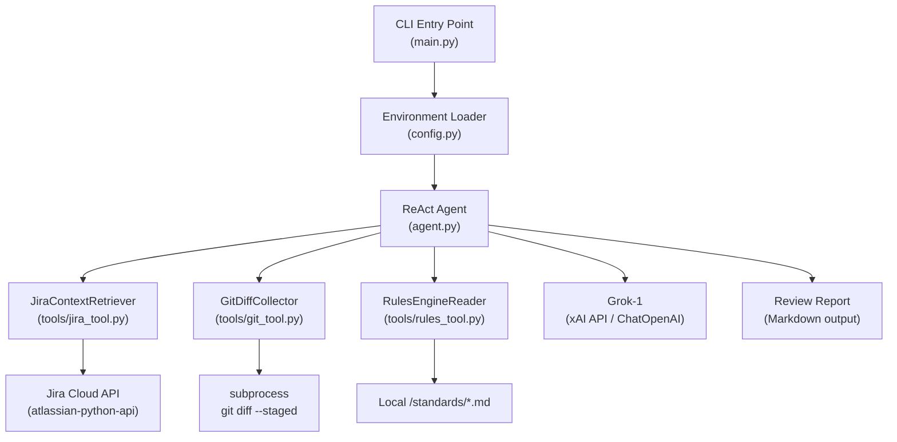

# Design Document: Code Review Agent

## Overview

The Code Review Agent is a Python CLI tool that automates pre-commit code review by orchestrating three data-gathering tools through a LangChain ReAct agent backed by Grok-1 (xAI API). Given a Jira ticket ID, the agent:

1. Fetches the ticket's acceptance criteria from Jira
2. Captures the current staged git diff
3. Loads team coding standards from local Markdown files
4. Applies Grok-1 reasoning to produce a structured Markdown review report

The agent enforces a fixed reasoning sequence (Jira → Git diff → Rules → Analysis) to ensure reproducible, thorough reviews. All secrets are loaded from a `.env` file and never exposed in output.

---

## Architecture



### Key Design Decisions

- **LangChain ReAct agent** (`create_react_agent`) is used rather than a custom loop so tool orchestration, retries, and prompt management are handled by a well-tested framework.
- **OpenAI-compatible client** (`langchain-openai` `ChatOpenAI`) targets `https://api.x.ai/v1`, avoiding a custom HTTP layer.
- **Fixed tool invocation order** is enforced via the system prompt and agent executor configuration rather than hard-coded sequential calls, keeping the agent extensible while still being deterministic for the standard review flow.
- **One module per tool** keeps each tool independently testable and replaceable.

---

## Components and Interfaces

### `config.py` — Environment Loader

Loads and validates all required environment variables at import time.

```python
def load_config() -> dict[str, str]:
    """Load and validate required env vars. Raises EnvironmentError on missing vars."""
```

Required variables: `XAI_API_KEY`, `JIRA_URL`, `JIRA_EMAIL`, `JIRA_API_TOKEN`.

### `tools/jira_tool.py` — JiraContextRetriever

LangChain `Tool` wrapping Jira ticket retrieval.

```python
def fetch_jira_context(ticket_id: str) -> str:
    """
    Connects to Jira via atlassian-python-api.
    Returns structured string with title, description, acceptance criteria.
    Returns error string (no exception) on missing ticket or connectivity failure.
    """
```

### `tools/git_tool.py` — GitDiffCollector

LangChain `Tool` wrapping `git diff --staged`.

```python
def collect_git_diff(_: str = "") -> str:
    """
    Runs git diff --staged via subprocess.
    Returns diff string, or descriptive error string if no staged files
    or not a git repo.
    """
```

### `tools/rules_tool.py` — RulesEngineReader

LangChain `Tool` that reads `/standards/*.md`.

```python
def read_coding_standards(_: str = "") -> str:
    """
    Scans /standards directory for .md files.
    Returns consolidated string with each file under a labelled section header.
    Returns error string if directory missing or empty.
    """
```

### `agent.py` — Agent Initialization

```python
def build_agent(config: dict[str, str]) -> AgentExecutor:
    """
    Initializes ChatOpenAI (Grok-1 via xAI), binds tools,
    and constructs a ReAct AgentExecutor with the reviewer system prompt.
    """
```

### `main.py` — CLI Entry Point

```python
def main() -> None:
    """
    Parses ticket_id from CLI args, builds agent, runs review, prints report.
    """
```

---

## Data Models

### Environment Config

```python
@dataclass
class AppConfig:
    xai_api_key: str      # XAI_API_KEY — never logged
    jira_url: str         # JIRA_URL
    jira_email: str       # JIRA_EMAIL
    jira_api_token: str   # JIRA_API_TOKEN — never logged
```

### Jira Ticket Context (internal string format)

```
## Jira Ticket: {ticket_id}
### Title
{title}
### Description
{description}
### Acceptance Criteria
{acceptance_criteria}
```

### Coding Standards Context (internal string format)

```
## Standards: {filename}
{file_contents}

## Standards: {filename2}
{file_contents2}
...
```

### Review Report (Markdown output)

```markdown
# Code Review Report — {ticket_id}

## Missing Requirements
- ...

## Code Quality Violations
- ...

## Suggested Fixes
- ...
```

If no issues are found:

```markdown
# Code Review Report — {ticket_id}

The code satisfies all requirements and standards.
```

---

## Correctness Properties

*A property is a characteristic or behavior that should hold true across all valid executions of a system — essentially, a formal statement about what the system should do. Properties serve as the bridge between human-readable specifications and machine-verifiable correctness guarantees.*


### Property 1: Config loads all required keys

*For any* valid `.env` file containing all four required variables (`XAI_API_KEY`, `JIRA_URL`, `JIRA_EMAIL`, `JIRA_API_TOKEN`), calling `load_config()` should return a dict containing all four keys with their correct values.

**Validates: Requirements 1.1**

---

### Property 2: Missing env var raises EnvironmentError

*For any* non-empty subset of the four required environment variables that is absent from the environment, calling `load_config()` should raise an `EnvironmentError` that names the missing variable.

**Validates: Requirements 1.2**

---

### Property 3: Secrets never appear in log output

*For any* set of secret values loaded by `load_config()`, capturing all log and console output produced during loading should yield a string that does not contain any of those secret values.

**Validates: Requirements 1.3**

---

### Property 4: Jira retrieval returns all required fields

*For any* valid `ticket_id` and any mocked Jira ticket with a title, description, and acceptance criteria, `fetch_jira_context(ticket_id)` should return a string containing all three fields.

**Validates: Requirements 2.1, 2.2**

---

### Property 5: Invalid or unreachable Jira returns error string, no exception

*For any* ticket_id that does not exist or any mocked connectivity failure, `fetch_jira_context(ticket_id)` should return a non-empty string and must not raise an exception.

**Validates: Requirements 2.3, 2.4**

---

### Property 6: Git diff collector returns subprocess output as string

*For any* mocked `git diff --staged` output, `collect_git_diff()` should return that exact output as a string, including the edge cases of empty output (no staged files) and subprocess errors (not a git repo), always returning a string and never raising.

**Validates: Requirements 3.1, 3.2, 3.3**

---

### Property 7: Standards reader consolidates all .md files under labelled headers

*For any* directory containing one or more `.md` files with arbitrary content, `read_coding_standards()` should return a single string that contains each filename as a section header and each file's full content, with no file omitted.

**Validates: Requirements 4.1, 4.2**

---

### Property 8: Missing or empty standards directory returns error string, no exception

*For any* invocation of `read_coding_standards()` where the `/standards` directory is absent or contains no `.md` files, the function should return a non-empty descriptive string and must not raise an exception.

**Validates: Requirements 4.3**

---

### Property 9: Agent tool invocation follows Jira → Git → Rules order

*For any* `ticket_id`, when the agent is run, the sequence of tool calls recorded should show JiraContextRetriever called before GitDiffCollector, and GitDiffCollector called before RulesEngineReader.

**Validates: Requirements 6.1, 6.2, 6.3**

---

### Property 10: Review report contains all required sections

*For any* agent run that completes analysis, the produced report string should contain the headings "Missing Requirements", "Code Quality Violations", and "Suggested Fixes" (or, when no issues are found, a statement that the code satisfies all requirements and standards).

**Validates: Requirements 7.1, 7.2, 7.3, 7.4, 7.5**

---

## Error Handling

| Failure Scenario | Component | Behaviour |
|---|---|---|
| Missing env var at startup | `config.py` | Raise `EnvironmentError` with variable name |
| Jira ticket not found | `jira_tool.py` | Return descriptive error string |
| Jira API unreachable | `jira_tool.py` | Return descriptive error string |
| No staged git files | `git_tool.py` | Return "no staged changes" string |
| `git` not found / not a repo | `git_tool.py` | Return descriptive error string |
| `/standards` missing or empty | `rules_tool.py` | Return descriptive error string |
| LLM API error | `agent.py` | Propagate as `RuntimeError` with context |

All tool-level errors are returned as strings so the agent can include them in its reasoning context rather than crashing the process. Only unrecoverable errors (missing config, LLM failure) propagate as exceptions.

---

## Testing Strategy

### Dual Testing Approach

Both unit tests and property-based tests are required. They are complementary:

- **Unit tests** cover specific examples, integration points, and error conditions.
- **Property tests** verify universal correctness across randomised inputs.

### Property-Based Testing

Use **Hypothesis** (Python) as the property-based testing library.

Each property test must:
- Run a minimum of **100 iterations** (configured via `@settings(max_examples=100)`)
- Include a comment referencing the design property it validates
- Use `@given` strategies to generate random inputs

Tag format in test comments:
```
# Feature: code-review-agent, Property {N}: {property_text}
```

Property test mapping:

| Design Property | Test | Strategy |
|---|---|---|
| Property 1 | `test_config_loads_all_keys` | Generate random valid string values for all four vars |
| Property 2 | `test_missing_var_raises` | Generate random non-empty subsets of the four required keys to omit |
| Property 3 | `test_secrets_not_in_logs` | Generate random secret strings, capture log output, assert absence |
| Property 4 | `test_jira_returns_all_fields` | Generate random ticket dicts with title/description/criteria |
| Property 5 | `test_jira_error_returns_string` | Mock missing ticket and connectivity failure |
| Property 6 | `test_git_diff_returns_string` | Generate random diff strings including empty string |
| Property 7 | `test_standards_consolidation` | Generate random sets of filenames and file contents |
| Property 8 | `test_standards_missing_dir_returns_string` | Invoke with missing/empty temp directory |
| Property 9 | `test_agent_tool_order` | Mock all three tools, run agent with random ticket_ids |
| Property 10 | `test_report_contains_sections` | Mock LLM response with random issue lists |

### Unit Tests

Focus on:
- `load_config()` with a fully populated `.env` (example)
- Agent initialisation: verify `base_url`, `api_key`, system prompt content (Requirements 5.1–5.3)
- `read_coding_standards()` with a known standards file to verify exact header format
- End-to-end smoke test with all tools mocked, verifying the report is non-empty Markdown

### Test File Layout

```
tests/
  test_config.py          # Properties 1–3, unit config tests
  test_jira_tool.py       # Properties 4–5
  test_git_tool.py        # Property 6
  test_rules_tool.py      # Properties 7–8
  test_agent.py           # Properties 9–10, unit agent tests
```
